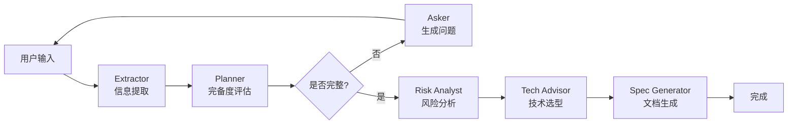

# 定型 Formative

> AI 开发前的需求澄清工具

定型（Formative）是一个位于「AI 写代码之前」的前置工具，通过多 Agent 对话流程，帮助用户将模糊、白话式的想法系统性地转化为 AI 可执行的开发方案。

## 特性

- ✅ 基于 LangGraph 的多 Agent 编排
- ✅ 内存持久化对话状态（MemorySaver）
- ✅ 智能需求澄清与补全
- ✅ 风险分析与技术选型建议
- ✅ 自动生成结构化开发文档
- 🚧 Redis Checkpointer（生产环境推荐）

## 技术栈

- **前端**: Next.js 15 + React 19 + TailwindCSS
- **Agent 编排**: LangGraph (TypeScript)
- **LLM**: DeepSeek / Qwen / Ollama（可配置）
- **状态存储**: MemorySaver（MVP），Redis（生产环境）
- **语言**: TypeScript

## 快速开始

### 1. 环境要求

- Node.js >= 18
- DeepSeek/Qwen API Key 或本地 Ollama

**注意**: MVP阶段使用内存存储（MemorySaver），暂不需要Redis。生产环境建议使用Redis Checkpointer。

### 2. 安装依赖

```bash
npm install
```

### 3. 配置环境变量

复制 `.env.example` 为 `.env` 并填写配置：

```bash
cp .env.example .env
```

必填配置：
- `LLM_PROVIDER`: LLM 提供商（deepseek/qwen/ollama）
- `LLM_API_KEY`: API 密钥（ollama 不需要）

可选配置：
- `REDIS_URL`: Redis 连接地址（暂不使用，预留）

### 4. 运行开发服务器

```bash
npm run dev
```

访问 [http://localhost:3000](http://localhost:3000)

## 项目结构

```
formative/
├── src/
│   ├── app/                    # Next.js App Router
│   │   ├── api/chat/          # Chat API 端点
│   │   ├── layout.tsx
│   │   └── page.tsx           # 主页面
│   ├── components/            # React 组件（未来扩展）
│   ├── lib/                   # 核心业务逻辑
│   │   ├── agents/           # Agent 节点实现
│   │   │   ├── extractor.ts
│   │   │   ├── planner.ts
│   │   │   ├── asker.ts
│   │   │   ├── risk-analyst.ts
│   │   │   ├── tech-advisor.ts
│   │   │   └── spec-generator.ts
│   │   ├── graph/            # LangGraph 编排
│   │   │   ├── state.ts
│   │   │   └── index.ts
│   │   ├── llm/              # LLM 调用层
│   │   │   └── helper.ts
│   │   ├── logger/           # 日志模块
│   │   │   └── index.ts
│   │   ├── memory/           # 记忆层
│   │   │   ├── interface.ts
│   │   │   ├── local-storage.ts
│   │   │   └── redis-checkpointer.ts
│   │   └── prompts/          # 提示词管理
│   │       └── index.ts
│   └── types/                # TypeScript 类型定义
│       └── index.ts
├── prompts/                  # 提示词模板
│   ├── extractor.system.md
│   ├── planner.system.md
│   ├── asker.system.md
│   ├── risk.system.md
│   ├── tech.system.md
│   └── spec.system.md
├── docs/                     # 文档
│   └── FormativePrd.md      # 产品需求文档
└── data/                     # 本地数据（可选）
```

## Agent 工作流程



## 阶段说明

1. **需求采集** (Stage 1): 提取产品目标、用户、场景、功能
2. **风险分析** (Stage 2): 识别技术风险，提供方案选项
3. **技术选型** (Stage 3): 推荐合适的技术栈
4. **MVP 边界** (Stage 4): 明确做什么、不做什么
5. **文档生成** (Stage 5): 输出完整的开发方案文档

## 开发指南

### 添加新的 Agent 节点

1. 在 `src/lib/agents/` 创建新节点文件
2. 实现节点函数，接收 `GraphStateType`，返回 `Partial<GraphStateType>`
3. 在 `src/lib/graph/index.ts` 中注册节点和边

### 自定义提示词

编辑 `prompts/` 目录下的 Markdown 文件，系统会自动加载。

### 切换 LLM 提供商

修改 `.env` 中的 `LLM_PROVIDER` 和相关配置即可。

## 常见问题

**Q: Redis 连接失败怎么办？**
A: MVP阶段使用内存存储，不需要Redis。如需使用Redis，请实现完整的RedisCheckpointer。

**Q: 支持哪些 LLM？**
A: 目前支持 DeepSeek、Qwen（阿里云）和本地 Ollama。所有兼容 OpenAI API 的提供商理论上都可以使用。

**Q: 会话数据会丢失吗？**
A: MVP阶段使用MemorySaver，服务重启会丢失数据。生产环境建议实现Redis Checkpointer实现持久化。

## 许可证

MIT
