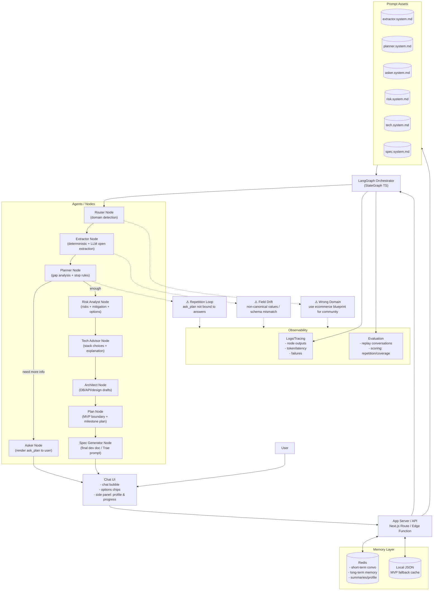
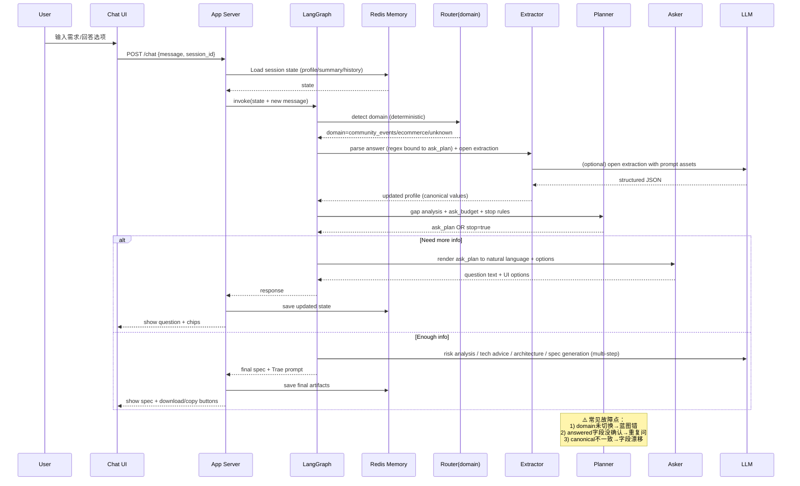

# 定型 Formative MVP 产品规格文档
## 1. 产品背景与目标
### 1.1 产品背景
在 VibeCoding 场景中，大量用户无法有效落地自己的产品想法，核心问题并不在于 AI 能否写代码，而在于：
- 用户无法清晰描述需求
- 用户不知道哪些信息是“工程上必须的”
- 用户无法判断 AI 输出是否合理
- 需求在反复修改中不断失真

定型（Formative） 是一个位于「AI 写代码之前」的前置工具，用于帮助用户将模糊、白话式的想法，系统性地转化为 AI 可执行的开发方案。

### 1.2 MVP 产品目标（Must Have）
MVP 阶段，定型只聚焦一个目标：
> 在一次对话流程中，引导用户完成需求澄清，并生成一份可直接交给 AI 开发的完整开发文档。

具体而言，MVP 必须做到：
- 引导用户补全关键信息（即使用户最初只有一句话）
- 控制提问节奏，避免无限追问
- 给出合理的技术方案建议（通俗可理解）
- 明确定义 MVP 边界
- 输出结构化、可复制的最终文档

### 1.3 MVP 非目标（Explicitly Out of Scope）
以下内容明确不在 MVP 范围内：
- ❌ 用户注册 / 登录 / 账户体系
- ❌ 项目管理（多项目、历史列表等）
- ❌ 实时协作
- ❌ 可视化 Workflow 编辑器
- ❌ 自动生成代码
- ❌ 部署 / CI / 运行监控
- ❌ 商业化 / 计费

## 2. MVP 功能范围定义
### 2.1 核心用户流程（单一主路径）
MVP 只支持一条强引导主路径：
1. 用户进入页面，看到 Chat UI
2. 用户输入一句自然语言需求
3. 系统启动多 Agent 流程，引导用户补全信息
   - Agent 1：确认需求是否完整
   - Agent 2：询问用户是否有任何工程上的限制（如性能、成本等）
   - Agent 3：根据用户输入，生成初步的技术方案建议
4. 用户在关键节点做选择（选项而非自由输入）
   - 例如：选择使用的 AI 模型、数据库类型等
5. 系统根据用户选择，生成最终的《开发方案文档》
6. 用户复制文档并离开

### 2.2 Agent 阶段划分（逻辑视角）
MVP 内部使用多 Agent，但对用户只暴露“阶段感”。
| 阶段 | 内部 Agent 职责 |
|------|------------------|
| 阶段 1 | 信息采集与需求澄清 |
| 阶段 2 | 风险识别与方案分歧 |
| 阶段 3 | 技术栈与架构建议 |
| 阶段 4 | MVP 边界确认 |
| 阶段 5 | 开发文档生成 |

## 3. Agent 架构设计（LangGraph）
### 3.1 技术选型
- 多 Agent 编排：LangGraph (TypeScript SDK)
- 模型调用：DeepSeek / Qwen / Ollama（抽象封装）
- 运行形态：Node.js
- 前端：Web Chat UI（React / Next.js）

### 3.2 Agent 列表与职责
#### 3.2.1 信息采集 Agent（Requirement Collector）
##### 职责：
- 从用户输入中提取以下信息：
  - 产品目标
  - 目标用户
  - 使用场景
  - 核心功能
- 是否需要数据存储
- 是否需要多人使用
- 通过追问补全缺失项
- 不解释技术细节，只做澄清

#### 3.2.2 需求完备度评估 Agent（Completeness Evaluator）

##### 职责：
- 维护一个「需求信息 Checklist」
- 计算当前完备度（0–100%）
- 判断是否可以进入下一阶段

##### 示例 Checklist：
- 产品目标明确
- 核心使用场景明确
- 是否需要登录
- 是否需要数据持久化
- MVP 功能范围明确

##### 规则：
- 完备度 ≥ 80% → 自动进入下一阶段
- 用户可手动选择「信息已足够，继续」

#### 3.2.3 风险分析 Agent（Risk & Option Analyzer）

##### 职责：
- 指出潜在风险：
  - 技术复杂度过高
  - 需求不适合 MVP
  - 第三方依赖风险
- 提供 2–3 种可选方案（降级 / 保守 / 激进）
- 使用通俗语言，不使用架构黑话

#### 3.2.4 技术选型 Agent（Tech Stack Advisor）

##### 职责：
- 给出整体方案类型：
  - 纯前端
  - 前后端分离
  - 前端 + BaaS（如 Supabase）
- 解释每种方案的：
  - 适合人群
  - 优缺点
  - 后期演进成本
- 进一步确定：
  - 前端框架（React / Vue）
  - 后端语言（如需要）
  - 运行环境版本

#### 3.2.5 文档生成 Agent（Spec Generator）

##### 职责：
- 汇总所有已确认信息
- 生成结构化 Markdown 文档
- 不引入新假设
- 明确写出「本期不做什么」

## 4. 记忆与状态设计（Redis）

### 4.1 设计原则
| 类型     | 目标 | 存储内容 | 生命周期 | 备注 |
|----------|------|----------|----------|------|
| 短期记忆 | 存过程 | 当前会话完整消息 | 会话期间 | 用于上下文回溯与调试 |
| 长期记忆 | 存结论 | 已确认的关键信息 | 可跨会话复用 | 不保存原始聊天记录，仅保留结构化结论 |

> 原则：聊天记录不进入长期记忆，避免噪音；Agent 仅依赖「阶段性总结」继续推进。

### 4.2 Redis Key 设计（MVP）
session:{sessionId}:messages        # 当前会话消息
session:{sessionId}:state           # Agent 状态 / 当前阶段
session:{sessionId}:summary         # 已确认的稳定结论

### 4.3 记忆更新规则
每完成一个阶段，生成阶段性总结
总结写入 session:{id}:summary
后续 Agent 优先读取 summary，而非原始对话记录

## 5. 前端 UI 设计（MVP）

### 5.1 设计原则

| 原则 | 说明 |
|------|------|
| **Chat-First** | 所有交互以对话为核心，用户无需离开聊天即可完成全部操作。 |
| **零配置** | 不提供独立配置页，所有选择通过聊天内嵌选项完成。 |
| **阶段可视** | 用户随时知道自己“在哪一步、还剩几步”。 |
| **信息只读摘要** | 侧边栏仅展示已确认结论，不可编辑，避免信息污染。 |
| **移动端优先** | 默认布局以竖屏手机为基准，桌面端同比例放大。 |

### 5.2 布局结构

#### 5.2.1 主聊天区（占屏 100% → 桌面 70%）

| 模块 | 说明 | 交互细节 |
|------|------|----------|
| 顶部阶段条 | 固定悬浮，格式：`阶段 2/4 · 风险与方案` | 点击可展开“阶段路线图”弹层 |
| 消息列表 | 按“用户-系统”交替排列，系统消息可带内嵌选项 | 用户消息支持重新编辑（长按/右键） |
| 快速选项 | 单选/多选按钮水平排布，最多 3 行，超量折叠 | 选中后立即自动发送，无需二次确认 |
| 输入框 | 单行文本，回车发送；Shift+回车换行 | 右侧“灯泡”图标可触发“AI 提示” |
| 底部辅助栏 | 左侧“保存并离开”，右侧“复制最终文档” | 仅最终阶段出现 |

#### 5.2.2 右侧摘要栏（桌面 30%，平板可收起）

| 模块 | 内容 | 更新时机 |
|------|------|----------|
| ① 阶段指示器 | 当前阶段高亮，已完成阶段可点击回溯 | 阶段推进时 |
| ② 关键信息摘要 | 以“标签+一句话”形式展示已确认项 | 每完成一个阶段刷新 |
| ③ 需求完备度 | 环形进度条 + 百分比数字 | 每轮 Agent 评估后刷新 |
| ④ 快捷导出 | “复制 Markdown”按钮 | 始终可见 |

> 摘要栏默认折叠于移动端底部，点击“📋”图标展开。

### 5.3 视觉与文案规范

| 元素 | 规范 |
|------|------|
| 主色 | `#0A7BFF`（对话气泡）、`#F5F7FA`（背景） |
| 字体 | 14 px 基础字号，行高 1.5；代码块使用 `SF Mono` |
| 阶段提示文案 | 统一以“我们”开头，例如：“我们已了解你的目标用户，接下来一起看看潜在风险。” |
| 按钮文案 | 动词+名词，≤ 6 字，如“选 React”、“继续下一步” |
| 错误提示 | 使用“警告气泡”而非弹窗，可一键重试 |

### 5.4 交互流程示例（阶段 2 → 3）

1. 用户完成阶段 2 最后一条选择；
2. 顶部阶段条自动滑入“阶段 3/4 · 技术栈建议”；
3. 右侧摘要栏新增“风险结论：建议保守方案”；
4. 完备度由 65% → 82%，环形条动画 0.8 s；
5. 系统发送技术方案卡片，内含 3 个横向选项按钮；
6. 用户点击任一选项 → 按钮置灰并显示“已选” → 自动发送消息 → 进入阶段 4。

### 5.5 异常与边界

| 场景 | 处理方案 |
|------|----------|
| 用户刷新页面 | 通过 `sessionId` 自动恢复聊天位置与摘要 |
| 网络断开 | 顶部出现“离线”红色条，消息进入待发送队列 |
| 长文本输入 | 输入框自动增高，最大 6 行，超出出现内部滚动 |
| 选项过多 | 横向滚动 + 左右箭头指示器，默认展示 3 项 |
| 回溯修改 | 允许点击已确认消息重新编辑，后续消息自动失效并重新评估 |

> 所有动画时长 ≤ 300 ms，优先使用 CSS `transition`，避免阻塞渲染线程。

## 6. 最终产出定义（MVP 核心交付）

### 6.1 文档格式
- **纯 Markdown**，语法兼容 GitHub Flavored Markdown  
- **单文件输出**，无外部依赖  
- **一键复制**按钮：前端提供「复制全文」图标，点击后直接落盘剪贴板  

### 6.2 文档结构（固定 9 大章节）
> 每章标题层级为 `#`，顺序不可调换；无内容时写「暂无」占位，确保结构完整。

| 章节 | 说明 | 是否允许空 |
|------|------|------------|
| 1. 项目概述 | 一句话电梯陈述 + 项目代号 | 必填 |
| 2. 产品目标 | 用「解决…实现…」句式，≤ 3 条 | 必填 |
| 3. 目标用户与使用场景 | 用户画像 + 痛点场景，各 1 句 | 必填 |
| 4. MVP 功能范围 | 用无序列表，≤ 5 条核心功能 | 必填 |
| 5. 非目标（本期不做） | 明确排除的功能或优化点 | 必填 |
| 6. 技术方案说明 | 纯前端 / 前后端 / BaaS 方案一句话 | 必填 |
| 7. 技术栈选择 | 用表格：类别 / 选型 / 理由，≤ 6 行 | 必填 |
| 8. 数据与接口设计 | ER 图文字描述 + 关键接口列表 | 可选，无数据写「不适用」 |
| 9. 开发步骤建议 | 按「Day1~Day7」拆任务，每天 1 行 | 必填 |

### 6.3 自动生成规则
1. 所有章节内容均来自「session:{id}:summary」中的已确认字段，禁止 LLM 二次发挥。  
2. 章节 8 若无数据存储需求，则整章输出：  
   ```markdown
   ## 8. 数据与接口设计  
   本期无持久化数据，接口暂不需要。
   ```
3. 章节 9 必须包含可执行检查点，例如：  
   - Day1 初始化仓库 & 部署空页面  
   - Day2 完成登录页 UI 走查  
   …  
   确保开发者复制即可逐日对照。

## 7. 架构图
### 7.1 系统架构图

### 7.2 单轮对话回合：LangGraph 节点时序
